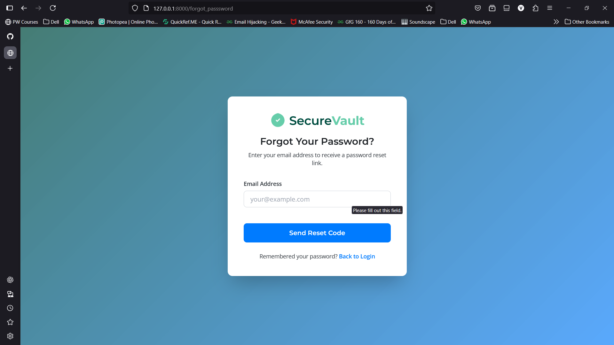
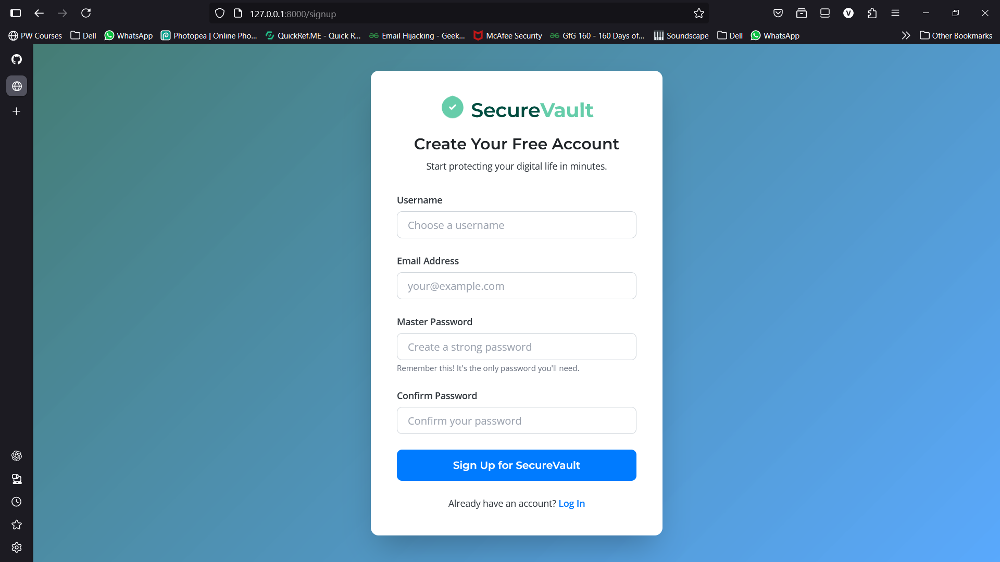
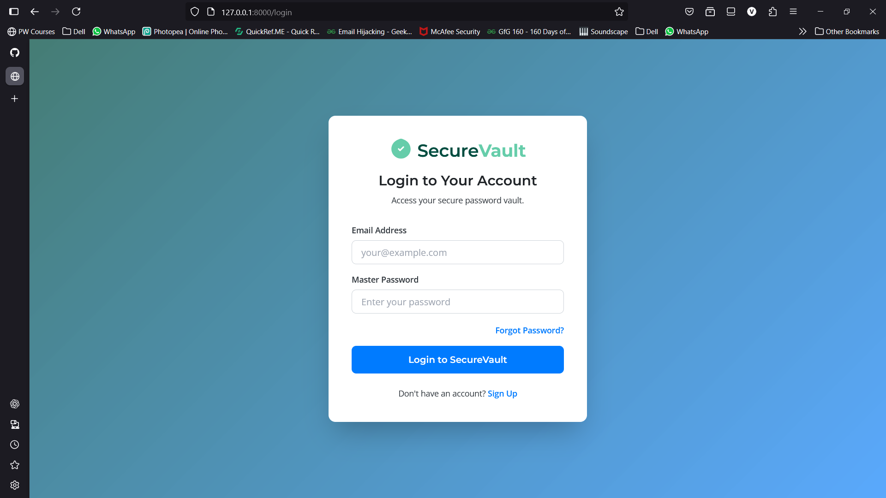
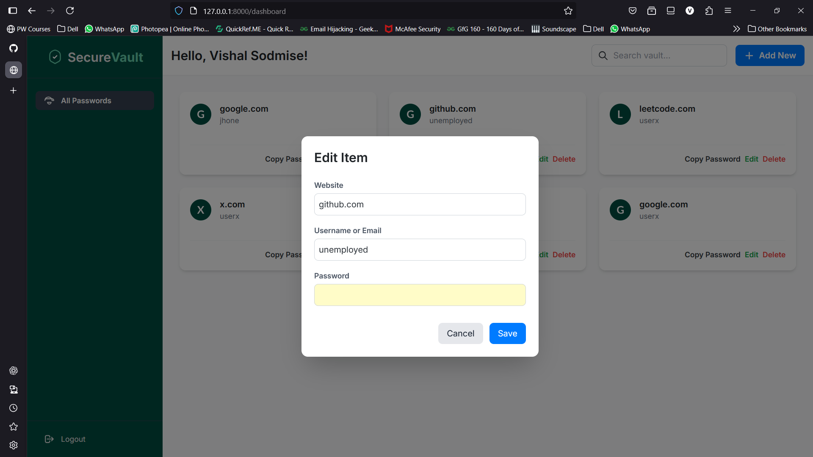
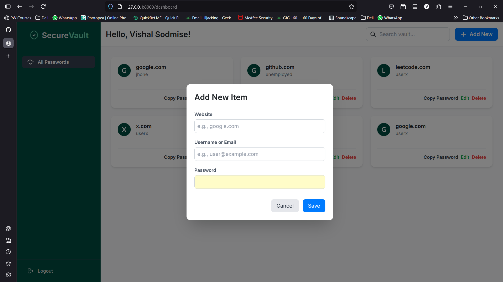
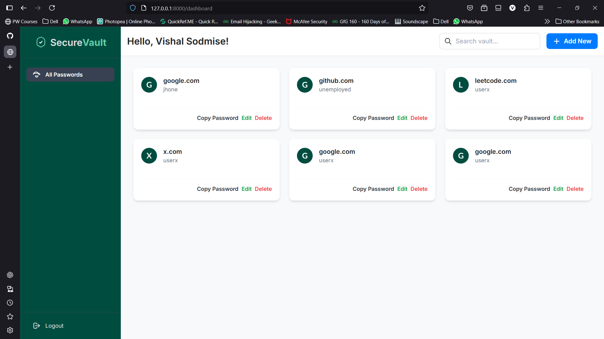

# SecureVault 🛡️

> A secure and user-friendly web-based password manager built with FastAPI and modern frontend technologies. SecureVault provides a digital fortress for your passwords, combining robust backend security with a sleek, responsive user interface.

![SecureVault Dashboard]









## 📖 Table of Contents

* [About The Project](#about-the-project)
* [Key Features](#-key-features)
* [Tech Stack](#-tech-stack)
* [Getting Started](#-getting-started)
    * [Prerequisites](#prerequisites)
    * [Installation](#installation)
* [API Endpoints](#-api-endpoints)
* [Project Structure](#-project-structure)
* [Contributing](#-contributing)
* [License](#-license)

## 🎯 About The Project

SecureVault was created to address the need for a simple, secure, and intuitive password management solution. It allows users to store, manage, and retrieve their login credentials from a centralized, encrypted vault. The application is built with a strong focus on security, from master password hashing to individual entry encryption, ensuring user data is always protected.

The frontend is designed to be modern and efficient, with a variety of animations and a clean layout that makes password management effortless. The backend is powered by the high-performance FastAPI framework, providing a robust and secure API.

## ✨ Key Features

###  Frontend (UI/UX)

* **🎨 Modern & Professional Design**: Aesthetically pleasing interface with a custom design system, color palette, and professional fonts (Montserrat, Open Sans, Inter).
* **🚀 Animated & Engaging UI**: Smooth page transitions, scroll-triggered animations, and micro-interactions like wavy text, floating logos, and pulsing icons.
* **🔒 Full User Authentication Flow**: Separate, styled pages for Signup, Login, Email Verification, and a complete Forgot/Reset Password process.
* **🖥️ Responsive Dashboard**: A collapsible sidebar and responsive grid layout provide a seamless experience on desktop, tablet, and mobile devices.
* **🗂️ Dynamic Password Grid**: Stored credentials are displayed in an easy-to-scan card format, complete with website logos (with a fallback to initial letters).
* **⚡ Quick Actions**: Copy passwords to the clipboard, edit details, or delete entries directly from the dashboard.
* **🔍 Real-time Search**: Instantly filter your vault by website name or username.
* ** modals**: Non-intrusive modals for adding, editing, and confirming the deletion of passwords.
* **✨ Polished Experience**: Custom scrollbars, loading spinners, and empty-state messages to guide the user.

### Backend (Security & API)

* **🚀 High-Performance API**: Built with **FastAPI** for speed and automatic interactive documentation.
* **🔐 Robust Authentication**: Secure session-based authentication with protected routes for all vault operations.
* **🛡️ Strong Password Security**:
    * Master passwords are **hashed** before being stored.
    * Individual vault passwords are **encrypted** using a dedicated key, ensuring they are unreadable even if the database is compromised.
* **✅ Input Validation**: Rigorous validation on the backend for all user inputs, including master password complexity checks.
* **✉️ Email Integration**: Handles sending verification and password reset emails.
* **🔄 Full CRUD Functionality**: A complete set of API endpoints for Creating, Reading, Updating, and Deleting password entries.
* **🏛️ Templating & Static Files**: Uses Jinja2 for rendering HTML templates and serves all static assets efficiently.

## 🛠️ Tech Stack

| Category      | Technology                                                                                                    |
| :------------ | :------------------------------------------------------------------------------------------------------------ |
| **Backend** | [Python](https://www.python.org/), [FastAPI](https://fastapi.tiangolo.com/)                                     |
| **Frontend** | [HTML5](https://en.wikipedia.org/wiki/HTML5), [Tailwind CSS](https://tailwindcss.com/), [JavaScript](https://www.javascript.com/) |
| **Templating**| [Jinja2](https://jinja.palletsprojects.com/)                                                                    |
| **Database** | SQL-based (Abstracted via `database.py`)                                                                       |
| **Server** | [Uvicorn](https://www.uvicorn.org/)                                                                           |

## 🚀 Getting Started

Follow these instructions to get a local copy of SecureVault up and running.

### Prerequisites

* Python 3.8+
* A package manager like `pip`
* An SMTP server or service (like Gmail, SendGrid, etc.) for sending emails.

### Installation

1.  **Clone the repository:**
    ```sh
    git clone [https://github.com/Vishal-43/Password-Manager](https://github.com/Vishal-43/Password-Manager)
    cd SecureVault
    ```

2.  **Create and activate a virtual environment:**
    * **macOS/Linux:**
        ```sh
        python3 -m venv venv
        source venv/bin/activate
        ```
    * **Windows:**
        ```sh
        python -m venv venv
        .\venv\Scripts\activate
        ```

3.  **Install the required dependencies:**
    ```sh
    pip install -r requirements.txt
    ```

4.  **Configure Environment Variables:**
    Create a `.env` file in the root directory by copying the example file:
    ```sh
    cp .env.example .env
    ```
    Now, open the `.env` file and fill in the necessary values:
    ```env
    # A long, random, and secret string for session management
    SECRET_KEY="your_super_secret_key"

    # Your database connection details
    DATABASE_URL="your_database_connection_string"

    # Your email server details for sending verification/reset emails
    EMAIL_HOST="smtp.example.com"
    EMAIL_PORT=587
    EMAIL_USER="your-email@example.com"
    EMAIL_PASSWORD="your_email_password"
    ```

5.  **Generate Encryption Key:**
    The application uses a `key.key` file to encrypt and decrypt vault passwords. Make sure this file is present. If not, you will need to generate one (a script for this might be included or needs to be created).

6.  **Run the application:**
    ```sh
    uvicorn main:app --reload
    ```
    The application will be available at `http://127.0.0.1:8000`.

## 📡 API Endpoints

The core API endpoints are defined in `web.py`.

| Method   | Endpoint                               | Protected | Description                                          |
| :------- | :------------------------------------- | :-------- | :--------------------------------------------------- |
| **POST** | `/signup`                              | No        | Registers a new user.                                |
| **POST** | `/verify`                              | No        | Verifies a new user's email with a code.             |
| **POST** | `/login`                               | No        | Logs in a user and creates a session.                |
| **GET** | `/logout`                              | Yes       | Logs out the current user and clears the session.    |
| **GET** | `/dashboard`                           | Yes       | Renders the main user dashboard.                     |
| **POST** | `/dashboard`                           | Yes       | Adds a new password entry to the user's vault.       |
| **GET** | `/list_passwords`                      | Yes       | Retrieves all password entries for the user (JSON).  |
| **PUT** | `/update_password/{item_id}`           | Yes       | Updates an existing password entry.                  |
| **DELETE**| `/delete_password/{item_id}`          | Yes       | Deletes a password entry.                            |

_(This is a summary. Additional endpoints for password reset exist.)_

## 📁 Project Structure


SecureVault/
├── .env                  # Environment variables (needs to be created)       
├── database.py           # Database connection and query logic
├── key.key               # Encryption key for the vault
├── main.py               # Main application file, encryption/decryption logic
├── sendmail.py           # Module for sending emails
├── web.py                # FastAPI routes, API logic
├── requirements.txt      # Python dependencies
├── static/               # CSS, JavaScript, images
│   
└── templates/            # HTML templates
├── index.html
├── login.html
├── signup.html
├── dashbord.html
└── ... (other auth pages)


## 🤝 Contributing

Contributions are what make the open-source community such an amazing place to learn, inspire, and create. Any contributions you make are **greatly appreciated**.

1.  Fork the Project
2.  Create your Feature Branch (`git checkout -b feature/AmazingFeature`)
3.  Commit your Changes (`git commit -m 'Add some AmazingFeature'`)
4.  Push to the Branch (`git push origin feature/AmazingFeature`)
5.  Open a Pull Request

## 📄 License

Distributed under the MIT License. See `LICENSE` for more information.

---

<p align="center">
  Copyright © 2024 - <span id="year"></span> SecureVault
</p>
<script>document.getElementById('year').textContent = new Date().getFullYear()</script>
